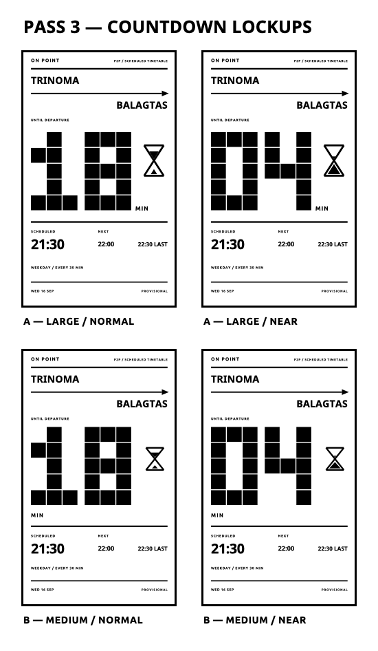

# On Point — Countdown Lockup Refinement

Status: visual review only. Production firmware remains unchanged.

This round keeps the selected Pass 2 Open Poster with hourglass and changes only the countdown lockup. Route treatment, product identity, timetable ledger, following departures, footer, and white-space structure are unchanged.

## A — Baseline MIN / large hourglass

Recommended.

- `MIN` is horizontal and visually attached to the lower-right of the giant numeral, producing a clear `18 MIN` or `04 MIN` reading.
- The context label is shortened to `UNTIL DEPARTURE`.
- `SCHEDULED` remains immediately beside the actual timetable departure time.
- Hourglass: approximately 62×96 px with a 6 px outline.
- The glass remains inside the countdown field and reads as part of the same lockup.
- The heavier outline and chunky triangular fills remain legible without fine neck detail.
- The existing timetable ledger stays at its Pass 2 position.

Individual 480×800 previews:

- [A — Normal](png/pass3-baseline-large-normal.png)
- [A — Near](png/pass3-baseline-large-near.png)

## B — Stacked MIN / medium hourglass

Close alternate.

- `MIN` sits immediately below the giant numeral and is unmistakable.
- Hourglass: approximately 56×70 px with a 5 px outline.
- The hourglass remains secondary, but still feels closer to an icon than a structural element.
- The extra unit line pushes the timetable ledger downward and makes the composition more vertically segmented.

Individual 480×800 previews:

- [B — Normal](png/pass3-stacked-medium-normal.png)
- [B — Near](png/pass3-stacked-medium-near.png)

## Recommendation

Proceed with **A — Baseline MIN / large hourglass** after visual approval.

It resolves the unit-legibility issue in one glance while preserving the Open Poster’s broad uninterrupted countdown field. The 96 px hourglass is large enough to function as a secondary identity element at arm’s length, and the numeral remains unquestionably primary.

## Renderer implications

- Replace the rotated unit with ordinary horizontal `drawText`; no new font or primitive is required.
- Increase the hourglass bounding box and line width, retaining the current line/polygon construction.
- Quantize sand fill into a small number of chunky steps rather than using fine continuous changes.
- Keep the shorter `UNTIL DEPARTURE` label and retain `SCHEDULED` beside the timetable time.
- No schedule-engine, clock, refresh, navigation, or state-model changes are implied.

No production renderer files were modified and no commit was made.
