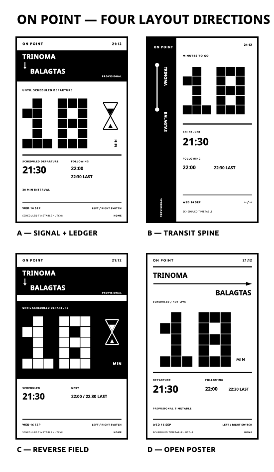
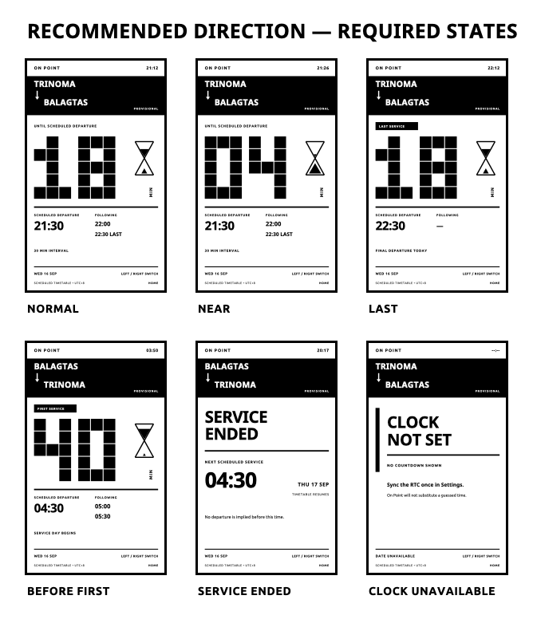

# On Point V1 — Visual Design Pass

Status: design review only. No firmware renderer or scheduling behavior has been changed.

All individual screen previews are monochrome PNGs at exactly 480×800. The host preview generator is isolated under this directory and uses only rectangles, polygons, strong rules, and text—the same basic vocabulary available to `GfxRenderer`.



## Candidate directions

### A — Signal + Ledger

The route sits in a stable full-width black signal band. The countdown occupies the broad white field below it, with a narrow right rail for `MIN` and the progressive hourglass. Departure and following times form a compact ledger beneath a heavy rule.

Strengths:

- Best one-glance answer: the countdown is the largest object and has no competing headline.
- Strong editorial identity without cards or decorative chrome.
- Route context is immediate and remains visually stable while the countdown changes.
- The hourglass occupies otherwise difficult right-side space and does not reduce numeral scale.
- Bottom ledger adapts cleanly to normal, first, last, ended, and error states.

Weaknesses:

- The black route band is a meaningful filled area; direction changes should therefore use a cleaning refresh.
- The modular numeral needs careful spacing for one-, two-, and three-digit values.

Recommendation: proceed with this direction after review.

### B — Transit Spine

A permanent black vertical rail turns the route into a two-stop diagram. The countdown and timetable occupy the white field to its right.

Strengths:

- Most explicitly cartographic direction.
- Distinctive silhouette and very clear separation between route and time.
- Stable black rail would not change during countdown refreshes.

Weaknesses:

- Rotated route labels take longer to read.
- The rail removes roughly one quarter of the usable width, limiting countdown scale.
- Long place names and localization would be harder to accommodate.

### C — Reverse Field

The countdown becomes a large black field with reversed white numerals and a white hourglass.

Strengths:

- Highest drama and strongest departure-board character.
- Excellent contrast in a static composition.
- Makes near-departure states feel urgent without adding animation.

Weaknesses:

- The frequently changing countdown sits inside the largest black area, increasing visible ghosting risk and refresh cost.
- White-on-black text is less forgiving of e-ink edge softening.
- The black field overpowers route and timetable context.

### D — Open Poster

An open white page uses a horizontal transit arrow, oversized numeral, and a minimal timetable baseline. The hourglass is omitted.

Strengths:

- Lowest black coverage and cleanest minute-to-minute update area.
- Route direction is extremely literal.
- Generous white space gives it a printed-poster quality.

Weaknesses:

- Less ownable than A; it approaches a generic information poster.
- The long arrow competes with the countdown for attention.
- Without the hourglass, interval progress has no secondary visual cue.

## Recommended direction and information hierarchy

Proceed with **A — Signal + Ledger**.

1. **Primary:** modular countdown numeral, approximately 217 px tall, occupying about 31% of the page height and most of the central width.
2. **Secondary:** route plate, then scheduled departure time.
3. **Tertiary:** following departures, first/last state, date, provisional status, and control hints.
4. **Diagnostic:** service-ended and clock-invalid messages replace—not compete with—the countdown.

The black route plate is deliberately stable. During ordinary countdown updates, only the white countdown/ledger area needs to change conceptually. Direction switching changes the plate and should retain the current cleaning-refresh behavior.

## Typography

The firmware already loads Noto Sans at 12, 14, 16, and 18 plus Ubuntu UI at 8, 10, and 12. The embedded fonts are fixed raster sizes; `GfxRenderer` has no general text-scaling path. A new font dependency is therefore not justified for this pass.

Proposed production mapping:

| Role | Existing treatment | Approximate line height |
| --- | --- | ---: |
| Giant countdown | Existing 3×5 modular geometry, refined to 44 px cells | 217 px glyph field |
| Route names | Noto Sans Bold 16 | 45 px |
| Scheduled departure / state headline | Noto Sans Bold 18 | 51 px |
| Following departures | Noto Sans Bold 14 | 40 px |
| Utility labels | Ubuntu Bold 10 | 24 px |
| Footer metadata | Existing small/Ubuntu 8–10 | about 19–24 px |

The preview uses the repository’s checked-in Noto Sans and Ubuntu source files. Final baselines and horizontal fit still need to be checked using actual `GfxRenderer` metrics and on-device rasterization.

Why retain the modular countdown:

- It reaches the necessary scale without adding flash-heavy font data.
- Every stroke remains a solid rectangle, avoiding fragile curves and thin diagonals.
- Leading zero treatment (`04`) remains deliberate and departure-board-like.
- It maps directly to existing `fillRect` calls and requires no heap allocation.

## Hourglass geometry

Keep the hourglass, but as a secondary diagram rather than an illustration:

- Bounding box: approximately 64×116 px.
- Stroke: 4 px minimum.
- Two straight triangular chambers meeting at one neck.
- Five discrete fill steps across a normal interval.
- Upper fill decreases while lower fill increases.
- No animation, gray, texture, antialias-dependent detail, or sand particles.
- Hidden entirely for service-ended and clock-invalid states.

It earns its place in Direction A because it balances the right rail and communicates interval progress without shrinking the numeral. It should be removed if the physical panel test shows the diagonal chamber edges becoming muddy.

## Required states



### Normal service

- Giant remaining minutes.
- Scheduled departure and two following departures.
- Neutral five-step hourglass state.
- Interval metadata remains tertiary.

### Near departure

- Keep the same layout; use a leading zero (`04`) to prevent the composition from collapsing horizontally.
- Hourglass shows most fill in the lower chamber.
- No flashing, inversion, or urgency iconography.

### Last trip

- Add a compact black `LAST SERVICE` utility flag above the numeral.
- Replace following departures with an em dash.
- Add `FINAL DEPARTURE TODAY` beneath the ledger.

### Before first service

- Add a compact `FIRST SERVICE` flag.
- Show the first scheduled departure and following times normally.
- Use `SERVICE DAY BEGINS` as tertiary context.

### Service ended

- Remove numeral, `MIN`, and hourglass.
- Use a large two-line `SERVICE ENDED` headline.
- Make the next scheduled time and service date the new secondary focus.
- Explicitly avoid implying a departure before that time.

### Clock unavailable / RTC invalid

- Do not render a countdown, departure time, or fabricated date.
- Replace the current-time utility with `--:--`.
- Use a strong `CLOCK NOT SET` headline and one short recovery instruction.
- State explicitly that On Point does not substitute guessed time.

## Preview files

Candidate layouts:

- [A — Signal + Ledger](png/candidate-signal-and-ledger.png)
- [B — Transit Spine](png/candidate-transit-spine.png)
- [C — Reverse Field](png/candidate-reverse-field.png)
- [D — Open Poster](png/candidate-open-poster.png)

Recommended-direction states:

- [Normal](png/state-normal.png)
- [Near departure](png/state-near.png)
- [Last trip](png/state-last.png)
- [Before first service](png/state-before-first.png)
- [Service ended](png/state-service-ended.png)
- [Clock unavailable](png/state-clock-unavailable.png)

## Reproducing the previews

Generate the design SVGs:

```sh
python3 design/on-point-visual-pass/render_previews.py
```

On macOS, rasterize them to exact-size PNGs with Quick Look and `sips`:

```sh
sh design/on-point-visual-pass/render_pngs.sh
```

The scripts and generated files remain separate from firmware production code. They do not call schedule logic or alter the committed renderer.
