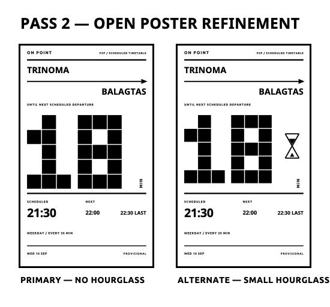
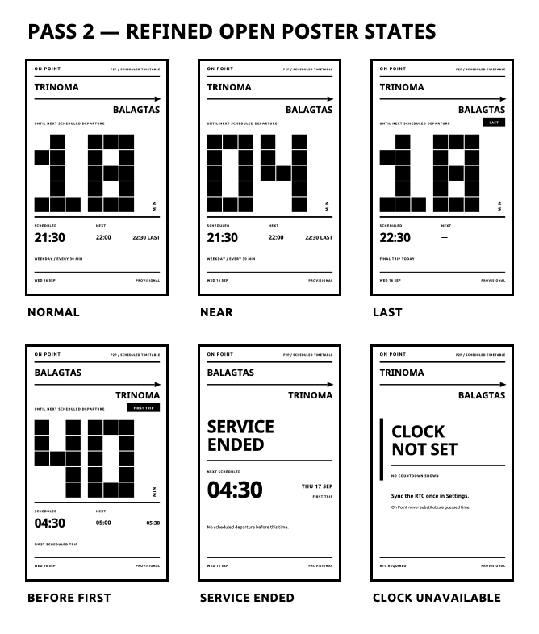

# On Point — Visual Refinement Pass 2

Status: visual review only. Production firmware and schedule behavior remain unchanged.

This pass uses **Direction D — Open Poster** as its basis. It removes the previous black route panel, prototype control hints, and redundant metadata while pushing the countdown scale further.

## Primary and close alternate



### Primary — Open Poster without hourglass

This is the recommended treatment.

- The route arrow is already the page's diagrammatic element.
- Removing the hourglass gives the countdown a 267 px-high field and more uninterrupted white space.
- The page reads as one printed composition rather than stacked panels.
- Minute changes affect black numeral blocks on white, not a large reversed field.

### Alternate — Small hourglass

The close alternate retains a 50×88 px hourglass with 4 px strokes and discrete fill. It is viable, but it slightly reduces numeral scale and introduces a second progress metaphor beside the countdown. Keep it only if physical-device review shows that users gain meaningful information from it.

## Refined required states



Individual 480×800 renders:

- [Normal](png/pass2-primary-normal.png)
- [Near departure](png/pass2-primary-near.png)
- [Last trip](png/pass2-primary-last.png)
- [Before first](png/pass2-primary-before-first.png)
- [Service ended](png/pass2-primary-service-ended.png)
- [Clock unavailable](png/pass2-primary-clock-unavailable.png)
- [Normal with small hourglass](png/pass2-alternate-hourglass-normal.png)

## Information and typography hierarchy

1. Countdown minutes.
2. Origin, route arrow, and destination.
3. Scheduled departure time.
4. Following departures.
5. `LAST` or `FIRST TRIP` state marker.
6. Date and removable provisional marker.
7. `P2P` service identity.

Proposed production treatments:

| Role | Treatment | Approximate line height / field |
| --- | --- | ---: |
| Countdown | Existing 3×5 modular geometry, 54 px cells | 267 px glyph field |
| Route names | Noto Sans Bold 16 | 45 px |
| Scheduled time and state headlines | Noto Sans Bold 18 | 51 px |
| Following departures | Noto Sans Bold 14 | 40 px |
| Labels and metadata | Ubuntu Bold 10 | 24 px |
| Product identity | Ubuntu Bold 10, tracked | 24 px |

No new font dependency is proposed. The oversized numeral remains geometry because the embedded font set is fixed-size and the block face is more robust at this scale.

## Spacing logic

- Outer margin: 24 px.
- Header baseline: approximately 31 px; 5 px rule at 52 px.
- Route field: approximately 76–178 px.
- Countdown context and numeral: approximately 194–519 px.
- Heavy ledger rule: 5 px at approximately 536 px.
- Departure/following ledger: approximately 562–684 px.
- Footer rule: 3 px at approximately 726 px.
- Footer metadata baseline: approximately 758 px.

The open center is intentional. The numeral is disproportionate by design, while all supporting information sits on stable horizontal alignments.

## Route and direction treatment

The origin is left-aligned above a strong horizontal arrow; the destination is right-aligned below it. Direction reversal swaps only the two endpoint labels:

```text
TRINOMA ─────────────────→ BALAGTAS
BALAGTAS ────────────────→ TRINOMA
```

No northbound/southbound label is needed. The layout models one scheduled departure from the named origin terminal and contains no visual affordance for intermediate stops, live positions, or arrival prediction.

The structure remains suitable for additional P2P route datasets. Longer terminal names will need controlled fitting or a two-line endpoint treatment during implementation, without changing the route model.

## P2P identity and metadata

`P2P / SCHEDULED TIMETABLE` sits in the upper-right utility line opposite `ON POINT`. It is visible but deliberately below the route and countdown hierarchy.

The footer now contains only:

- date, when trustworthy;
- `PROVISIONAL`, while the dataset remains unverified.

The provisional marker is isolated and right-aligned so it can disappear without moving any other content. `LEFT / RIGHT SWITCH`, `HOME`, repeated timetable explanations, and development-style instructions are removed.

## State behavior

### Normal

Show the giant countdown, scheduled departure, and two compact following departures under `NEXT`.

### Near

Use a leading zero (`04`) so the oversized composition retains its width. Do not invert, flash, or add alarm styling.

### Last

Use a compact black `LAST` marker above the countdown and `FINAL TRIP TODAY` as quiet metadata. Do not turn the screen into an alert.

### Before first

Use `FIRST TRIP`, show the first scheduled departure normally, and retain the following departures.

### Service ended

Replace the countdown composition with `SERVICE ENDED`, followed by the next scheduled time, date, and `FIRST TRIP`. The route remains visible.

### Clock unavailable

Render no countdown, current time, departure time, or fabricated date. Show `CLOCK NOT SET`, one recovery instruction, and an explicit statement that guessed time is not substituted.

## Renderer implications

- The countdown continues to use the existing fixed rectangular digit grid; no heap allocation or new font asset is required.
- The route uses existing `drawLine` and `fillPolygon` primitives.
- The vertical `MIN` can use the existing rotated-text renderer rather than a custom bitmap.
- The white countdown field is friendlier to frequent fast refreshes than the reverse-field candidate.
- Route changes redraw the structural arrow and endpoint labels and should continue to request a cleaning refresh.
- Preview coordinates are specific to 480×800. Production code should derive the page from `getScreenWidth()`, `getScreenHeight()`, and the oriented viewable bounds.
- New visible state wording must use the existing i18n path when implemented.
- No schedule-engine, RTC, refresh-timing, or input behavior needs to change for this visual direction.

## Preview tooling

The existing isolated host preview generator now produces both the original exploration and Pass 2 assets:

```sh
python3 design/on-point-visual-pass/render_previews.py
sh design/on-point-visual-pass/render_pngs.sh
```

No production renderer files were modified and no final renderer commit was made.
